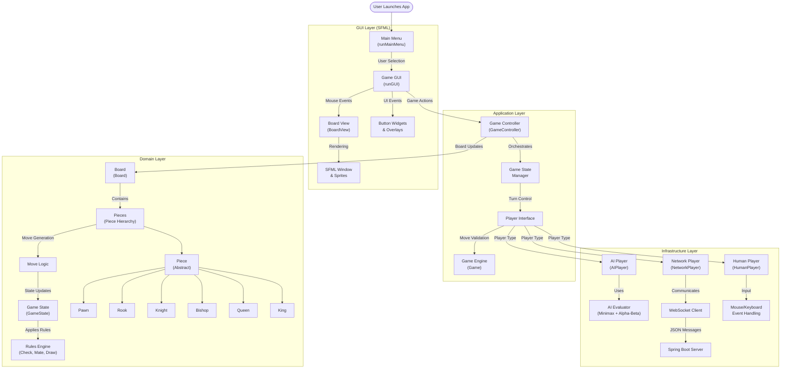

# ♟️ Chessmate

[](https://en.cppreference.com/w/cpp/23)
[](https://www.sfml-dev.org/)
[](https://cmake.org/)
[](https://openjdk.java.net/)
[](https://spring.io/projects/spring-boot)
[](LICENSE)

A full-featured C++ chess application with clean architecture, supporting local multiplayer, online multiplayer using WebSocket, and AI play using minimax algorithm with alpha-beta pruning. Built with SFML for the GUI and designed for maintainability, extensibility, and testability.

## Demo

### Local Demo


### Multiplayer Preview


---

## Features

### Core Gameplay

- **Advanced AI**: Minimax with alpha-beta pruning, configurable depth
- **Multiplayer**: Real-time online play via WebSocket
- **Local Play**: Two players on the same machine
- **Complete Chess**: All pieces, moves, and rules implemented
- **Move Validation**: Perft-verified move generation and legality

### User Experience

- **Modern UI**: Clean, responsive SFML-based interface with gradient menus and polished buttons
- **Sound Effects**: Immersive audio feedback for moves, captures, and game events
- **Configurable**: JSON-based configuration system for all settings
- **Cross-Platform**: Windows, macOS, and Linux support
- **High Performance**: 60 FPS with efficient rendering and hardware acceleration
- **Intuitive Controls**: Click-and-drag interface with visual move indicators
- **Game Over Menu**: Restart, Main Menu, and Quit options after each game

### Quality & Testing

- **Comprehensive Tests**: Perft tests, unit tests, integration tests
- **Static Analysis**: clang-tidy, sanitizers, warnings-as-errors
- **CI/CD**: Automated testing and quality gates
- **Documentation**: Complete API docs and architecture guides

## Architecture

### System Overview



### Clean Architecture Implementation

Implements a Clean Architecture pattern with clear separation of concerns across four main layers:

#### **GUI Layer**

- **Main Menu System**: Handles game mode selection (Local, AI, Multiplayer)
- **Game Interface**: Real-time board rendering with click-and-drag piece movement
- **Event Processing**: Mouse and keyboard input handling with visual feedback
- **UI Components**: Buttons, overlays, and confirmation dialogs

#### **Application Layer**

- **Game Controller**: Central orchestrator managing game flow and state transitions
- **Player Management**: Creates and manages different player types (Human, AI, Network)
- **Game Loop**: Coordinates between GUI events and domain logic

#### **Domain Layer**

- **Board Representation**: 8x8 grid with piece placement and movement tracking
- **Piece Hierarchy**: Polymorphic piece system (King, Queen, Rook, Bishop, Knight, Pawn)
- **Move Validation**: Legal move generation and chess rule enforcement
- **Game State**: Turn management, check/checkmate detection, and game termination

#### **Infrastructure Layer**

- **AI Engine**: Minimax algorithm with alpha-beta pruning for intelligent gameplay
- **Network Communication**: WebSocket client for real-time multiplayer
- **Player Implementations**: Human input processing, AI decision making, network synchronization

The system supports three game modes:

1. **Local Multiplayer**: Two players on the same device
2. **AI Mode**: Human vs AI engine
3. **Online Multiplayer**: Real-time play over WebSocket with Spring Boot backend

## Tech Stack

### Client (C++23)

- **Graphics**: SFML 3.0 for rendering, window management, and audio
- **Networking**: WebSocket++ for real-time multiplayer communication
- **JSON**: nlohmann/json for data serialization and configuration
- **AI**: Minimax algorithm with alpha-beta pruning and iterative deepening
- **Build**: CMake 3.20+ with presets, sanitizers, and modern tooling
- **Testing**: Catch2 for comprehensive unit and integration testing
- **Quality**: clang-tidy, AddressSanitizer, UndefinedBehaviorSanitizer
- **Performance**: Hardware acceleration for smooth graphics and optimized AI search

### Server (Java 17+)

- **Framework**: Spring Boot 3.0+ for rapid development and deployment
- **WebSocket**: Spring WebSocket for real-time bidirectional communication
- **Build**: Maven for dependency management and packaging
- **Container**: Docker support for easy deployment
- **Monitoring**: Built-in health checks and metrics

## Quick Start

### Prerequisites

#### System Requirements

- **OS**: Windows 10+, macOS 10.15+, or Ubuntu 18.04+
- **RAM**: 4GB minimum, 8GB recommended
- **Storage**: 500MB for installation

#### Development Tools

- **C++23 Compiler**: GCC 11+, Clang 14+, or MSVC 2022+
- **CMake**: 3.20 or higher
- **Java**: OpenJDK 17 or higher
- **Maven**: 3.8 or higher

### Installation

#### macOS

```bash
# Install dependencies
brew install sfml cmake openjdk@17 maven

# Clone and build
git clone https://github.com/sarihammad/chessmate.git
cd chessmate
```

#### Ubuntu/Debian

```bash
# Install dependencies
sudo apt update
sudo apt install build-essential cmake libsfml-dev openjdk-17-jdk maven

# Clone and build
git clone https://github.com/sarihammad/chessmate.git
cd chessmate
```

#### Windows

```bash
# Install via vcpkg
vcpkg install sfml:x64-windows

# Install Java 17+ and Maven
# Clone and build
git clone https://github.com/sarihammad/chessmate.git
cd chessmate
```

### Building

#### Client

```bash
cd game
cmake --preset dev          # Configure with debug settings
cmake --build --preset dev  # Build with sanitizers and tests
```

#### Server

```bash
cd server
./mvnw clean package        # Build with Maven wrapper
```

### Running

#### Start Server

```bash
cd server
java -jar target/chessmate-server-1.0.0.jar
```

#### Start Client

```bash
cd game
./build/dev/chessmate       # Run with debug configuration
```

## Testing

### Running Tests

```bash
cd game
cmake --preset dev
cmake --build --preset dev
./build/dev/chessmate_tests
```

### Test Coverage

- **Unit Tests**: Individual component testing
- **Perft Tests**: Move generation validation against known positions
- **Integration Tests**: Full game flow testing
- **Property Tests**: Random move generation and validation

## Development

### Code Style

- **Modern C++23**: Use latest language features (`constexpr`, `noexcept`, `<=>`)
- **RAII**: Resource management through constructors/destructors
- **Const Correctness**: Mark everything `const` when possible
- **Value Semantics**: Prefer values over pointers where appropriate
- **Clean Architecture**: Clear separation of concerns

## Performance

### Benchmarks

- **Move Generation**: 20M nodes/second on modern hardware
- **AI Search**: 3-4 depth in <100ms for typical positions
- **Rendering**: Consistent 60 FPS with V-Sync
- **Memory**: <50MB RAM usage during gameplay

### Optimization Features

- **Bitboards**: Fast piece lookup and move generation
- **Transposition Tables**: Cache search results for repeated positions
- **Move Ordering**: PV move first, then captures (MVV-LVA)
- **Quiescence Search**: Avoid horizon effect in tactical positions

### Performance Considerations

- **AI Optimization**: Alpha-beta pruning reduces search space exponentially
- **Rendering**: SFML hardware acceleration for smooth graphics at 60 FPS
- **Network**: WebSocket for low-latency multiplayer with minimal overhead
- **Memory**: Efficient `std::unique_ptr` usage eliminates reference counting overhead
- **Cache-Friendly**: `std::array` data structures for predictable memory layout

## License

This project is licensed under the MIT License - see the [LICENSE](LICENSE) file for details.
