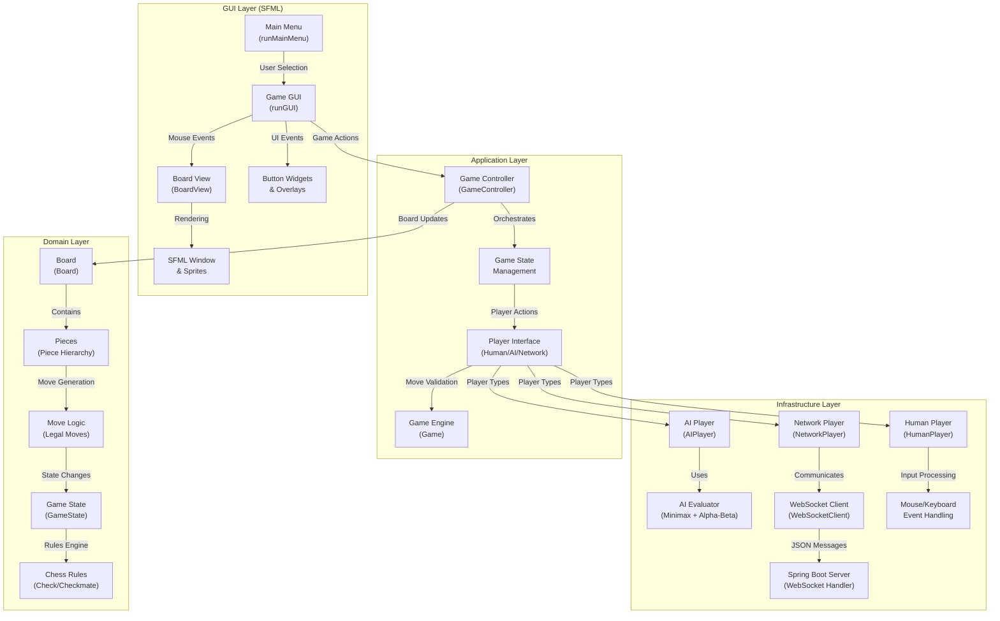

# Chessmate

A full-featured C++ chess application with a clean architecture, supporting local multiplayer, online multiplayer using WebSocket, and AI play using minimax algorithm with alpha-beta pruning. Built with SFML for the GUI and designed for maintainability, extensibility, and testability.

## Demo

### Local Game Demo


### Multiplayer Preview


---

## Architecture



---

## System Overview

Chessmate implements a Clean Architecture pattern with clear separation of concerns across four main layers:

### **GUI Layer**

- **Main Menu System**: Handles game mode selection (Local, AI, Multiplayer)
- **Game Interface**: Real-time board rendering with click-and-drag piece movement
- **Event Processing**: Mouse and keyboard input handling with visual feedback
- **UI Components**: Buttons, overlays, and confirmation dialogs

### **Application Layer**

- **Game Controller**: Central orchestrator managing game flow and state transitions
- **Player Management**: Creates and manages different player types (Human, AI, Network)
- **Game Loop**: Coordinates between GUI events and domain logic

### **Domain Layer**

- **Board Representation**: 8x8 grid with piece placement and movement tracking
- **Piece Hierarchy**: Polymorphic piece system (King, Queen, Rook, Bishop, Knight, Pawn)
- **Move Validation**: Legal move generation and chess rule enforcement
- **Game State**: Turn management, check/checkmate detection, and game termination

### **Infrastructure Layer**

- **AI Engine**: Minimax algorithm with alpha-beta pruning for intelligent gameplay
- **Network Communication**: WebSocket client for real-time multiplayer
- **Player Implementations**: Human input processing, AI decision making, network synchronization

The system supports three game modes:

1. **Local Multiplayer**: Two players on the same device
2. **AI Mode**: Human vs AI engine
3. **Online Multiplayer**: Real-time play over WebSocket with Spring Boot backend

---

## Features

- **Local Multiplayer:** Two players on the same device with intuitive click-and-drag interface
- **AI Opponent:** Minimax algorithm with alpha-beta pruning for challenging gameplay
- **Online Multiplayer:** Real-time play over WebSocket with Spring Boot backend
- **Modern UI:** Gradient menus, polished buttons, and in-game overlays
- **Game Over Menu:** Restart, Main Menu, and Quit options after each game
- **Clean Architecture:** Clear separation of domain, application, GUI, and infrastructure layers
- **Sound Effects:** Audio feedback for moves, captures, and game events
- **Visual Feedback:** Valid move indicators and capture square highlighting

---

## Tech Stack

- **Frontend:** SFML (Graphics, Window, System, Audio), C++17
- **Backend:** Spring Boot (Java), WebSocket, Maven
- **AI:** Minimax algorithm with alpha-beta pruning
- **Networking:** WebSocket++, nlohmann/json
- **Build System:** CMake, Make

---

## Build & Run

### Build Instructions

#### 1. Clone and Setup

```bash
git clone https://github.com/sarihammad/chessmate.git
cd chessmate
```

#### 2. Build Game Client

```bash
cd game
mkdir build && cd build
cmake ..
make
```

#### 3. Build Server (Optional for multiplayer)

```bash
cd ../../server
mvn spring-boot:run
```

### Run the Application

#### Game Client

```bash
cd game/build
./chessmate
```

#### Multiplayer Server

```bash
cd server
java -jar target/chessmate-server-1.0.0.jar
```

---

## Development & Extension

### Performance Considerations

- **AI Optimization**: Alpha-beta pruning reduces search space
- **Rendering**: SFML hardware acceleration for smooth graphics
- **Network**: WebSocket for low-latency multiplayer
